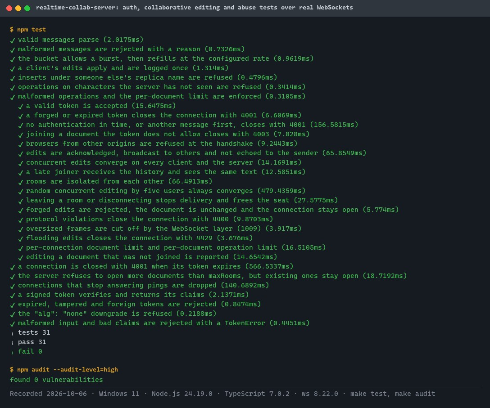
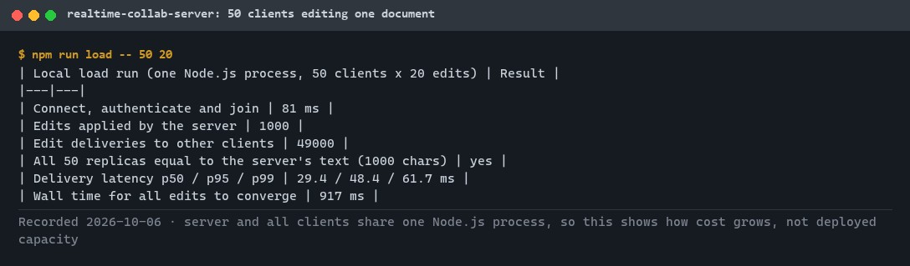
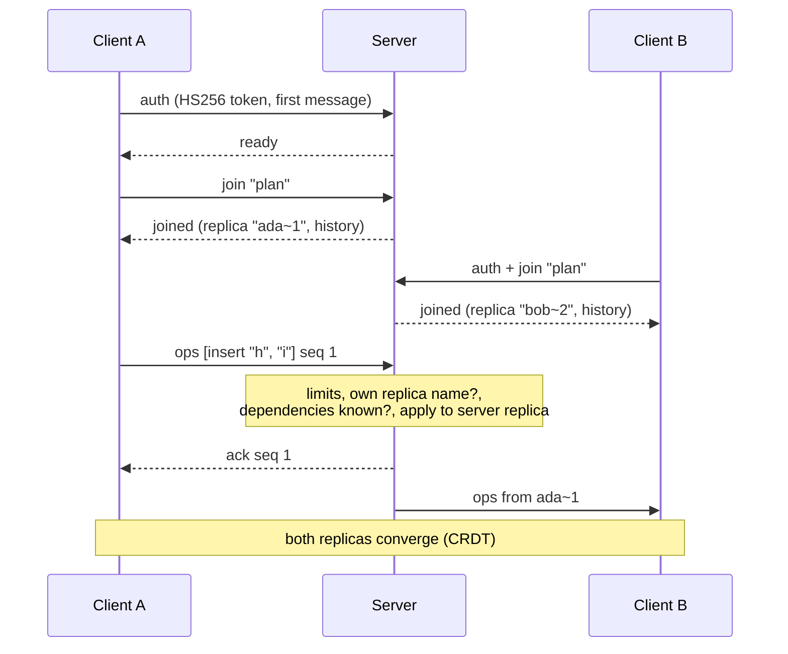
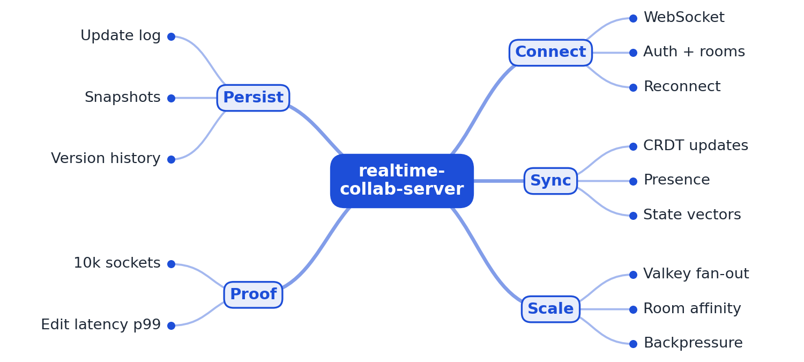
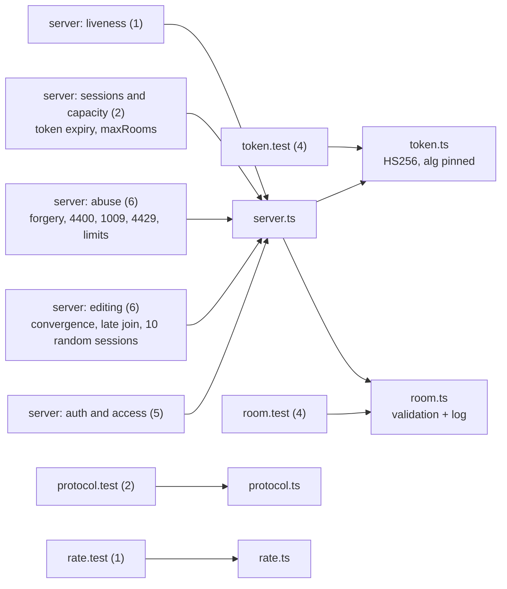

# realtime-collab-server

[](https://github.com/EquinoxWN/realtime-collab-server/actions/workflows/ci.yml)


> Live multiplayer text editing over WebSockets on top of a CRDT: authenticated rooms where every client converges to the same text, with guards against forged edits, floods and oversized messages.

Part of my **Backend and API** list · TypeScript · core project

> Builds on: [crdt-collab-engine](https://github.com/EquinoxWN/crdt-collab-engine) (vendored in `src/crdt/`)

## Proof it works

Every test talks to a real server over WebSockets on a random local port: authentication, document access, convergence under concurrent editing, and abuse (forged edits, floods, oversized frames, expired tokens). 31 tests, 0 failed, and the dependency audit is clean:



`make load` puts 50 clients on one document and checks that every replica ends equal to the server's text:



## Architecture

**What M1 runs today:**



**Full roadmap (M1 to M3):**



## How it works

_Steps 1 and 2 are built and tested (M1); the rest is on the [roadmap](#roadmap)._

1. Clients connect over WebSocket, authenticate and join a document room.
2. Edits travel as small CRDT updates; the server applies each one and broadcasts it to others in the room.
3. Presence messages carry cursors and selections without being stored.
4. When a room spans several server nodes, Valkey pub/sub fans updates out across them.
5. Updates append to a log and are compacted into snapshots, which also powers version history.
6. Slow clients get backpressure instead of unbounded buffers, and reconnecting clients resync using state vectors.

## Tech stack

| Area | In M1 | Planned |
|---|---|---|
| Core | Node.js / TypeScript, `ws` WebSocket server, the vendored CRDT engine | uWebSockets.js, Valkey pub/sub across nodes |
| Storage | - | Postgres snapshots, S3 update history |
| Test | Tests against a real local server, local load run (up to 200 clients) | k6 WebSocket load tests, Playwright multi-browser tests |

Language: **TypeScript** (strict, compiled with `tsc`). Server in [`src/server.ts`](src/server.ts), Node.js client in [`src/client.ts`](src/client.ts), the CRDT engine vendored from crdt-collab-engine in [`src/crdt/`](src/crdt).

## Run it

**Prerequisites:** Node.js 24+. Dependencies (`ws` at runtime; TypeScript for the build) install into `node_modules/`.

```bash
make setup   # npm ci
make lint    # strict TypeScript type check
make test    # 31 tests, most with real WebSocket clients on a random local port
make load    # 200 local clients editing one document: convergence and latency
```

Run the server on its own:

```bash
COLLAB_SECRET="$(openssl rand -hex 32)" ALLOWED_ORIGINS=https://editor.example npm start
```

### Protocol

JSON text frames over one WebSocket. Tokens are HS256 JWTs with `sub` (user id) and `docs` (allowed document ids, or `*`), issued by your auth service with the same secret.

| Direction | Message | Meaning |
|---|---|---|
| client to server | `{"type":"auth","token":"..."}` | Must be the first message, within 5 s |
| client to server | `{"type":"join","doc":"plan"}` | Join a room the token allows |
| client to server | `{"type":"ops","doc":"plan","seq":1,"ops":[...]}` | CRDT inserts and deletes made locally |
| server to client | `{"type":"joined","doc":"plan","replica":"ada~7","ops":[...]}` | Your replica name and the document history |
| server to client | `{"type":"ops","doc":"plan","from":"bob~3","ops":[...]}` | Someone else's edit |
| server to client | `{"type":"ack","seq":1}` or `{"type":"error","seq":1,...}` | Your batch was applied, or rejected |

Close codes: 4001 unauthorised, 4003 forbidden document, 4400 protocol violation, 4429 rate limited, 1009 frame too large.

### Use the Node.js client

```ts
import { CollabClient } from "realtime-collab-server";
const client = await CollabClient.connect("ws://127.0.0.1:8080", token);
const doc = await client.join("plan");
await doc.insert(0, "hello");          // resolves when the server acknowledges it
doc.onChange(() => console.log(doc.text));
```

## Tests and results

Full numbers and commands: [docs/results/m1.md](docs/results/m1.md).

| Check | Result |
|---|---|
| Tests (`make test`) | **31 passed**, 0 failed |
| Convergence | every client equals the server in every test, including 10 random sessions of 5 users |
| Security checks | forged tokens, `alg: none`, expired tokens (at connect and mid-session), wrong document, too many documents, wrong origin, forged edits, floods and oversized frames all refused |
| Lint | strict `tsc`: no errors |
| Audit | `npm audit`: 0 vulnerabilities |

| Local load run (one process) | Delivery latency p50 / p99 | Converged |
|---|---|---|
| 10 clients x 50 edits | 2.5 / 6.2 ms | yes |
| 50 clients x 20 edits | 27.2 / 49.7 ms | yes |
| 200 clients x 20 edits | 576 / 1,075 ms | yes |

The 200-client run shares one event loop between the server and every client; the real 10,000-socket measurement is M3.

### Test map



## Roadmap

**M1** (≈15 h)
- [x] Write `docs/rfc/0001-design.md`: problem, goals, non-goals, chosen design
- [x] Clients connect over WebSocket, authenticate and join a document room.
- [x] Edits travel as small CRDT updates; the server applies each one and broadcasts it to others in the room.

**M2** (≈20 h)
- [ ] Presence messages carry cursors and selections without being stored.
- [ ] When a room spans several server nodes, Valkey pub/sub fans updates out across them.

**M3** (≈25 h)
- [ ] Updates append to a log and are compacted into snapshots, which also powers version history.
- [ ] Slow clients get backpressure instead of unbounded buffers, and reconnecting clients resync using state vectors.
- [ ] Publish the proof below with real numbers

## Proof

What this repo must show before it counts as done:

- A k6 run with 10k concurrent sockets and edit latency p99.

| Result | Value |
|---|---|
| M3 proof above | Not measured yet (M3). Current M1 numbers: see [Tests and results](#tests-and-results). |

## Why it matters

- **Interview angle:** 'Design a real-time collaborative editor at scale'.
- **Upstream I'd like to contribute to:** Yjs ecosystem (y-websocket, Hocuspocus).

## Design docs

- [RFC 0001: design](docs/rfc/0001-design.md)
- [ADR 0001: record architecture decisions](docs/adr/0001-record-architecture-decisions.md)
- [ADR 0002: vendor the CRDT engine](docs/adr/0002-vendor-the-crdt-engine.md)
- [ADR 0003: first-message token and server authority](docs/adr/0003-first-message-token-and-server-authority.md)
- [M1 results](docs/results/m1.md)

## Scope

This is a learning and portfolio system, not a hosted production service. Everything runs locally.

## Security and contributing

- Every GitHub Action is pinned to a commit SHA; workflows run read-only, without persisted credentials.
- Dependabot proposes dependency and action updates weekly.
- Tokens are HS256 with the algorithm pinned and constant-time comparison; every per-connection resource is bounded; CI runs `npm audit` on every push.
- Report vulnerabilities privately: see [SECURITY.md](SECURITY.md). To contribute, see [CONTRIBUTING.md](CONTRIBUTING.md).

## License

MIT, see [LICENSE](LICENSE).
